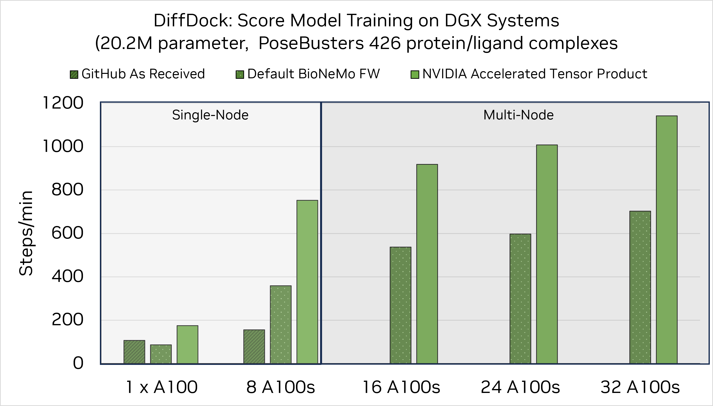

# DiffDock
# Model Overview

## Description:

DiffDock is a diffusion generative model for drug discovery in molecular blind docking [1]. DiffDock consists of two models: the Score and Confidence models.  

The Score model is a 3-dimensional equivariant graph neural network that has three layers: embedding, interaction layer with 6 graph convolution layers, and output layer. In total, the Score model has 20M parameters. The Score model is used to generate a series of potential poses for protein-ligand binding by running the reverse diffusion process. The Confidence model has a similar architecture as the Score model but with 5 graph convolution layers in the interaction layer. In total, the Confidence model has 5M parameters. The Confidence model is used to rank the generated ligand poses from the Score model. These models are ready for commercial use.   

## Third-Party Community Consideration 
This donor model was not owned or developed by NVIDIA. This model has been developed and built to a third-party’s requirements for this application and use case; see [link to Non-NVIDIA Model Card](https://github.com/gcorso/DiffDock/tree/main). 

## References:
[Provide list of reference(s), link(s) to the publication/paper/article, associated works, and lineage where relevant.]    
[1] Corso, Gabriele, Hannes Stärk, Bowen Jing, Regina Barzilay, and Tommi Jaakkola. "Diffdock: Diffusion steps, twists, and turns for molecular docking." arXiv preprint arXiv:2210.01776 (2022).

## Model Architecture: 
**Architecture Type:** Score-Based Diffusion Model (SBDM)   
**Network Architecture:**  Graph Convolution Neural Network (GCNN)  

## Input:
**Input Type(s):**  Text (PDB, SDF, MOL2, SMILES)  
**Input Format(s):** Protein Data Bank (PDB) Structure files for proteins, Structural Data Files (SDF), Tripos molecule structure format (MOL2) Structure files and Simplified molecular-input line-entry system (SMILES) strings for ligands  
**Other Properties Related to Input:** Pre-Processing Needed  

## Output:
**Output Type(s):** Text (Ligand Molecules, Confidence Score)  
**Output Format:** Structural Data Files (SDF)  
**Output Parameters:** Confidence Score and the rank based on this score 

## Software Integration:
**Runtime Engine(s):** 
* NeMo, BioNeMo   

**Supported Hardware Microarchitecture Compatibility:**  
* [Ampere]  
* [Hopper]  

**[Preferred/Supported] Operating System(s):**  
* [Linux]  
* [Windows]  

## Model Version(s): 
diffdock_score.nemo, version: 23.08
diffdock_confidence.nemo, version: 23.08

# Evaluation: 
## Evaluation Dataset:
**Link:** [PoseBusters benchmark (PDB) set](https://zenodo.org/records/8278563))   
**Data Collection Method by dataset**  
* [Human]  

**Labeling Method by dataset**  
* [Hybrid: Human & Automated]  

**Properties:** 428 protein-ligand complexes manually curated using the PDB database  

## Inference:
**Engine:** NeMo  
**Test Hardware:**  
* Ampere  

## Benchmarks

The pretrained DiffDock checkpoints for score and confidence models are available for download: `diffdock_score.nemo` and `diffdock_confidence.nemo`. These have been converted to the NeMo format from publicly available checkpoints. This section provides accuracy benchmarks for these models, as well as information on expected training speed performance. Currently, models trained from randomly initialized weights within the BioNeMo framework are not provided. The production of these models is ongoing work.

### Accuracy Benchmarks

The accuracy of DiffDock was measured over the 428 protein complexes from the PoseBusters benchmark {cite:p}`buttenschoen2023posebusters` available in [zenodo](https://zenodo.org/records/8278563). The metrics was computed from 20 independent runs with the [DiffDock GitHub](https://github.com/gcorso/DiffDock/commit/bc6b5151457ea5304ee69779d92de0fded599a2c) and the DiffDock in this BioNeMo Framework, and use the same evaluation scripts as in DiffDock GitHub. Due to the inherent stochasticity of DiffDock during the molecular docking generation, the metrics are not expected to be identical.

| Dataset     | Number of Poses Sampled | Metric                                  | BioNeMo | GitHub |
|-------------|-------------------------|-----------------------------------------|---------|--------|
| PoseBusters |            10           | Percentage of Top-1 RMSD<2 Å (%) &uarr; | 26.74   | 25.30  |
| PoseBusters |            10           | Median of Top-1 RMSD (Å) &darr;         | 5.00    | 5.35   |
| PoseBusters |            10           | Percentage of Top-5 RMSD<2 Å (%) &uarr; | 37.39   | 35.48  |
| PoseBusters |            10           | Median of Top-5 RMSD (Å) &darr;         | 2.92    | 3.06   |

### Training Performance Benchmarks

Training speed was tested on DGX-A100 systems GPUs with 80GB of memory. Three comparisons were made: 1) DiffDock GitHub As-Received from original author source 2) DiffDock integrated into BioNeMo FW 3) NVIDIA Acceleration of Tensor Product operation in DiffDock. Transition 1-->2 highlights the BioNeMo FW, while 2-->3 showcases the minute operation improvement and subsequent scaling implemented by NVIDIA engineers. 

While the BioNeMo FW makes use of adaptive batch samplers depending on dataset size, we keep a fixed micro_batch size of 4 in the FW, and a batch size of 4 for the DiffDock As-Received code.

The As-Received version of DiffDock does not support multi-GPU operations, and therefore is not shown in the second panel of benchmarking. 

## Limitations
DiffDock is currently restricted to static snapshot understanding of single ligand and protein interactions. For more involved systems included multi-ligands in a single protein pocket, multiple protein pockets without a ligand blocker, DiffDock inference may perform poorly due to the unaware implications of ligand-ligand interactions in solvent. Because ESM2 is used as a featurizer, some non-standard amino acids are ignored in the process. 

Size-aware batch sampler is used because the memory from the cross-graph (ligand-receptor) fluctuate a lot.  Size-aware batch sampler estimate the upper bound of memory usage from estimating the upper bound of the number of cross graphs, and do sampling or prepare batch of samples to avoid Out-Of-Memory error.

Primary data limitations for the original implementation of DiffDock arise in non-uniform sizes from the cross-graph (ligand-receptor). In the forward diffusion, ligands are randomly perturbed, and a dynamic cutoff is used to build cross graph between ligand and receptor, this results in a dynamic cross graph that has fluctuating edges, depending on the diffusion time and resulting in fluctuating memory usage. This has been solved in the BioNeMo FW implementation `SizeAwareBatchSampler`. This setting can be used to estimate the upper bound of memory usage from estimating the upper bound of the number of cross graphs, and do sampling or prepare batchs of samples to avoid Out-Of-Memory error.

## License
DiffDock is provided under the {{model_license_slug}}.
