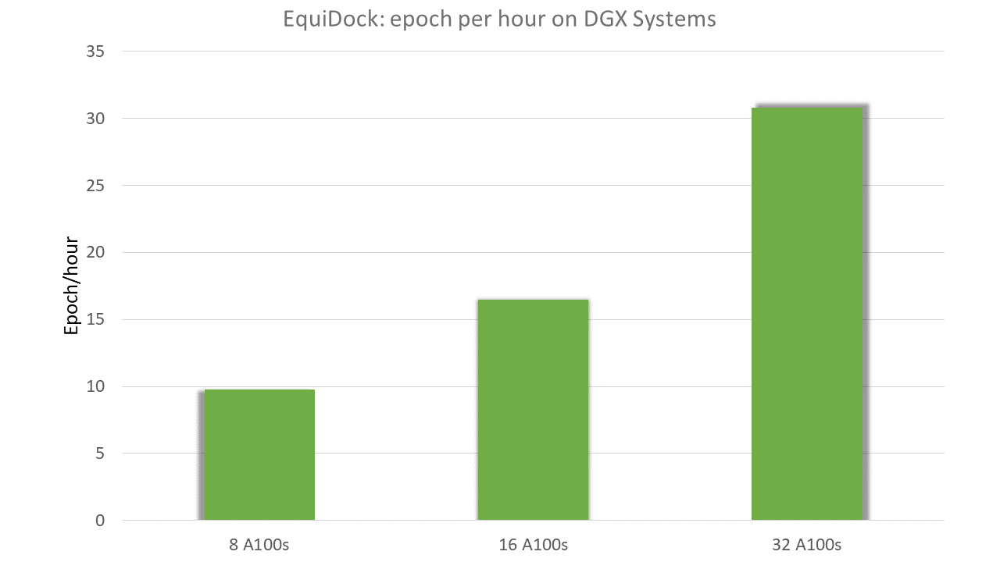

# EquiDock

## Model Overview

EquiDock {cite:p}`ganea2021independent` is an SE(3)-equivariant model that can predict protein-protein complex formation from two invidual proteins. EquiDock treats both the proteins as rigid bodies and assumes no conformation change during the formation of the complex.

## Intended Use

Almost all biological processes involve proteins interacting with each other. Prediction of protein complexes can be used understand disease progression and also in the design of novel proteins that can preferentially interact with other proteins of choice.

## Model Architecture

EquiDock was implemented using the BioNeMo framework. EquiDock uses Independent E(3)-Equivariant Graph Matching Network (IEGMN) that performs graph feature embedding updates in addition to E(3)-equivariant coordinate updates. EquiDock uses a novel attention-based selection of keypoints to represent binding pocket of each protein via a differentiable variant of the Kabsch algortihm {cite:p}`kabsch1976solution`. In addition, the EquiDock architecture also gaurantees commutativity ie., docking protein 1 with respect to protein 2 gives identical results as docking protein 2 with respect to protein 1.

## Limitations

EquiDock is designed to treat proteins as rigid bodies and would not work well with proteins that undergo significant change in conformation upon binding.

## Training

### Dataset

The EquiDock model leverages two primary datasets: Docking Benchmark 5.5 (DB5.5) {cite:p}`vreven2015updates` and the Database of Interacting Protein Structures (DIPS) {cite:p}`townshend2019end`. DB5.5, considered a gold standard dataset for data quality, consists of 253 structures. On the other hand, DIPS is a larger dataset of protein complex structures obtained from the Protein Data Bank (PDB), specifically tailored for rigid body docking. It's noted that DIPS contains only bound structures, making it suitable for rigid docking, while DB5.5 includes unbound protein structures, mostly displaying rigid structures.

Training involves initially training models on the training part of DIPS using the Adam optimizer with a learning rate of 2e-4. Early stopping is employed with a patience of 30 epochs. The best validation model is determined based on Ligand RMSD on the DIPS validation set.

For DB5.5, the DIPS pre-trained model is fine-tuned on the DB5.5 training set using a learning rate of 1e-4 and early stopping with 150 epochs patience. During training, roles of ligand and receptor are randomly assigned, and both ligand rotation and translation are randomly applied, even though the model is invariant to these operations.

### Infrastructure and Configuration

The EquiDock model can be trained from scratch with the code and datasets provided. The `equidock_dips.nemo` and `equidock_db5.nemo` model checkpoints provided here were adapted from the public chekpoints available on [GitHub](https://github.com/octavian-ganea/equidock_public/tree/main/checkpts).

## Benchmarks

Two pretrained EquiDock checkpoints are available for download: `equidock_dips.nemo` and `equidock_db5.nemo`. These have been converted to the NeMo format from publicly available checkpoints. This section provides accuracy benchmarks for these models, as well as information on expected training speed performance. Currently, models trained from randomly initialized weights within the BioNeMo framework are not provided. The production of these models is ongoing work.

### Accuracy Benchmarks

The accuracy of EquiDock was measured using the complex and interface root-mean-squared distance {cite:p}`ganea2021independent`, which are measured over test datasets of DIPS and DB5.

| RMSD type                       | Checkpoint Name      | Dataset           | Dataset Split for Measurement | Metric    | BioNeMo  |  Public  |
|---------------------------------|----------------------|-------------------|-------------------------------|-----------|----------|----------|
| Complex RMSD                    | equidock_dips.nemo   | DIPS              | test                          | median    | 13.39    | 13.39    |
| Complex RMSD                    | equidock_dips.nemo   | DIPS              | test                          | mean      | 14.52    | 14.52    |
| Complex RMSD                    | equidock_dips.nemo   | DIPS              | test                          | std       | 7.13     | 7.13     |
| Interface RMSD                  | equidock_dips.nemo   | DIPS              | test                          | median    | 10.24    | 10.24    |
| Interface RMSD                  | equidock_dips.nemo   | DIPS              | test                          | mean      | 11.92    | 11.92    |
| Interface RMSD                  | equidock_dips.nemo   | DIPS              | test                          | std       | 7.01     | 7.01     |
| Complex RMSD                    | equidock_db5.nemo    | DB5               | test                          | median    | 14.13    | 14.13    |
| Complex RMSD                    | equidock_db5.nemo    | DB5               | test                          | mean      | 14.73    | 14.72    |
| Complex RMSD                    | equidock_db5.nemo    | DB5               | test                          | std       | 5.31     | 5.31     |
| Interface RMSD                  | equidock_db5.nemo    | DB5               | test                          | median    | 11.97    | 11.97    |
| Interface RMSD                  | equidock_db5.nemo    | DB5               | test                          | mean      | 13.23    | 13.23    |
| Interface RMSD                  | equidock_db5.nemo    | DB5               | test                          | std       | 4.93     | 4.93     |

### Training Performance Benchmarks

Training speed was tested on DGX-A100 systems with 8 IEGM layers over DIPS dataset for one epoch, on GPUs with 80GB of memory.

## License

EquiDock is provided under the {{model_license_slug}}.