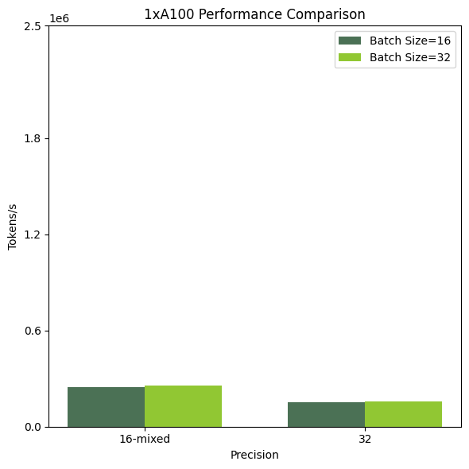
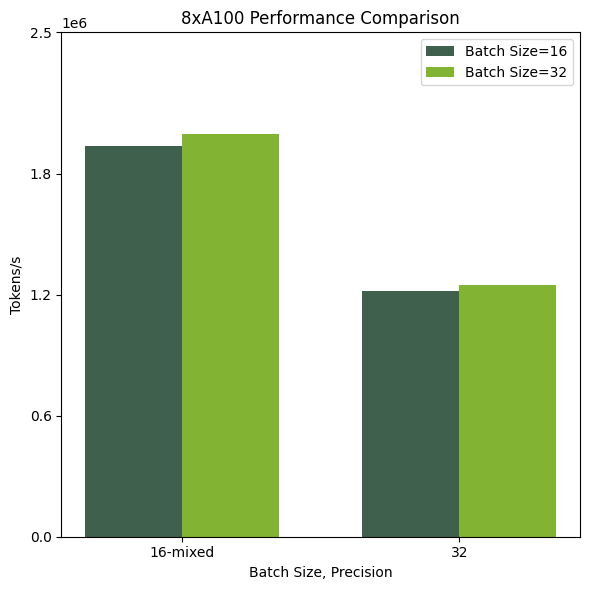

# Model Overview

## Description:
NOTE: sc-FM/Geneformer is currently considered a BETA release. There may be bugs with the pre-trained model and associated pre-training pipelines.

sc-FM generates a dense representation of a sc-RNA cell by learning co-expression patterns within single cells. sc-FM is a tabular count model trained on sc-RNA from the Chan Zuckerberg Cell x Gene census. sc-FM computes a complete embedding for each cell over the top 1024 expressed genes. The embeddings are used as features for a variety of predictive tasks. This model is ready for both commercial use.

## References:
Geneformer, reference foundation model for single-cell RNA: Transfer learning enables predictions in network biology | Nature
scGPT, alternative foundation model for single-cell RNA: scGPT: toward building a foundation model for single-cell multi-omics using generative AI | Nature Methods
scBERT, alternative foundation model for single-cell RNA: scBERT as a large-scale pretrained deep language model for cell type annotation of single-cell RNA-seq data | Nature Machine Intelligence
scFoundation, alternative foundation model for single-cell RNA: Large Scale Foundation Model on Single-cell Transcriptomics | bioRxiv
Cell x Gene census, public repository for sc-RNA experiments: CZ CELLxGENE Discover - Cellular Visualization Tool (cziscience.com)

## Model Architecture: 
**Architecture Type:** Bidirectional Encoder Representations from Transformers (BERT)   
**Network Architecture:** Geneformer  

## Input: 
**Input Type(s):** Number (Row represents cell, containing gene names and single cell expression counts)  
**Input Format(s):**  Array AnnData 
**Input Parameters:** 1D  

## Output:
**Output Type(s):** Vector (Dense Embedding Predictions)embeddings.  
**Output Format:** NumPy  
**Output Parameters:** 1D  
**Other Properties Related to Output:** Numeric floating point vector   

## Software Integration:
**Runtime Engine(s):** 
* BioNeMo, NeMo 1.2  

**Supported Hardware Microarchitecture Compatibility:**  
* Ampere  
* Hopper  
* Volta  

**[Preferred/Supported] Operating System(s):**  
* Linux  

## Model Version(s): 
geneformer\_31M\_240430.nemo, version 1.0   

# Training & Evaluation: 

## Training Dataset:
Genecorpus-30 provided by the original genformer publication. CellXGene census used for the direct download of the datasets referenced in genecorpus-30.

**Link:** ctheodoris/Genecorpus-30M · Datasets at Hugging Face, CZ CELLxGENE Discover - Cellular Visualization Tool (cziscience.com)  
** Data Collection Method by dataset  
* [Human]  

**Properties (Quantity, Dataset Descriptions, Sensor(s)):**  29.9 Million single cells collected from a variety of public datasets, all hosted by CZI cell x gene census.  

## Evaluation Dataset:
Adamson et al 2016 PERTURB-seq dataset, accessed by Harvard dataverse. 
**Link:**  adamson.zip - Harvard Dataverse  
** Data Collection Method by dataset  
* [Human]  

** Labeling Method by dataset  
* Automated - molecular barcoding  

**Properties (Quantity, Dataset Descriptions, Sensor(s)):** There are ~20k single cells, half of which represent unperturbed control samples, and the other half which contain an additional datatable containing the CRISPR knock-out targets for each cell.  
**Dataset License(s):** General Terms of Use | Dataverse Support (harvard.edu)  

## Inference:
**Engine:** BioNeMo, NeMo  
**Test Hardware:**  
* Ampere  
* Hopper  
* Volta   

## Performance Benchmarks:
Training performance benchmarks were performed on systems with 1xA100 80GB and 8xA100 80GB. Performance was computed at two batches, 16 and 32, with fp16-mixed precision and fp32 precision, respectively. Larger batch sizes go out of memory with fp32 precision on 80GB A100 systems.

## Ethical Considerations:

NVIDIA believes Trustworthy AI is a shared responsibility and we have established policies and practices to enable development for a wide array of AI applications.  When downloaded or used in accordance with our terms of service, developers should work with their team to ensure this model meets requirements for the relevant industry and use case and addresses unforeseen product misuse.  For more detailed information on ethical considerations for this model, please see the Model Card++ Explainability, Bias, Safety & Security, and Privacy Subcards [Insert Link to Model Card++ here].  Please report security vulnerabilities or NVIDIA AI Concerns [here](https://www.nvidia.com/en-us/support/submit-security-vulnerability/).

