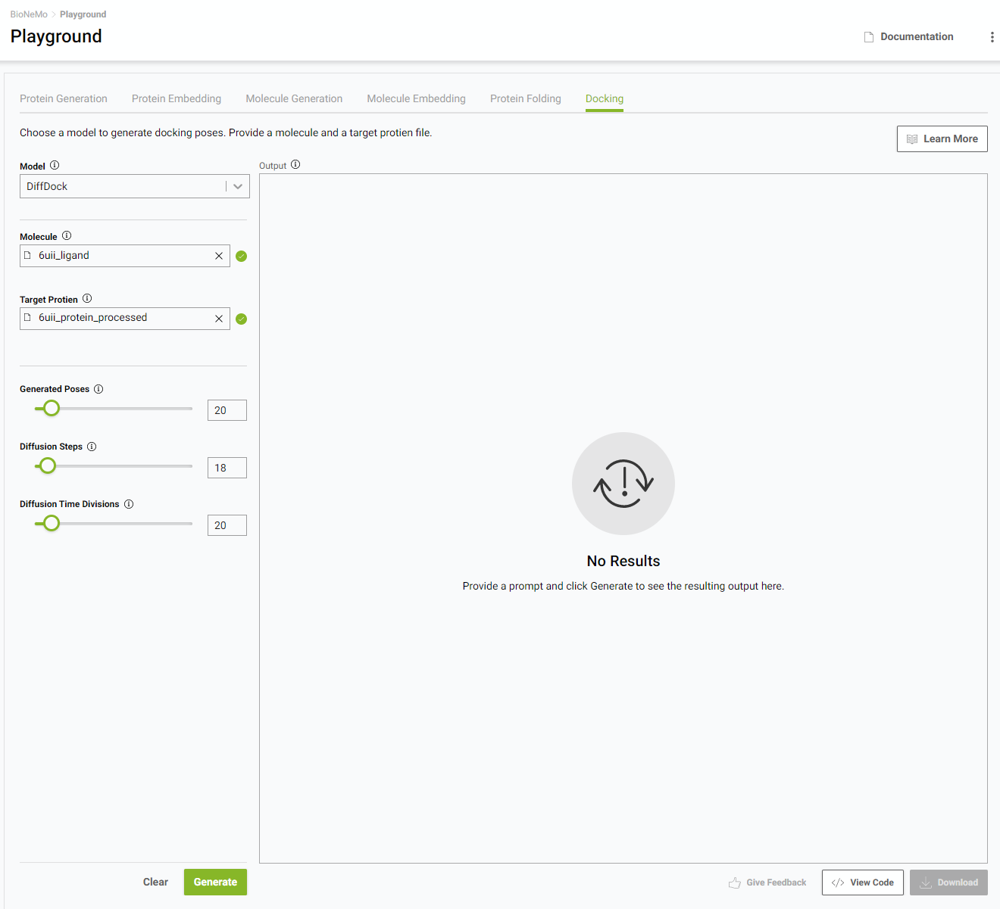

# Overview

Biomolecular large language models (LLMs) are achieving incredible breakthroughs in chemistry and biology, such as enabling 3D protein structure prediction, property prediction, and even generation of novel protein sequences and molecules. This progress has facilitated developments in the pharmaceutical industry such as antibody design, small-molecule drug design, and newer approaches like RNA aptamer and peptide-based therapeutics.

Let's focus on one example: a key use case for antibody design is thermostability.  An antibody’s stability greatly influences its specificity and affinity and, therefore, is a critical issue for researchers developing antibody therapeutics. Measuring the thermal stability of an antibody requires expressing or synthesizing the antibody and measuring the stability experimentally, which is a time-consuming and expensive process.  This makes the prospect of a model that can predict an antibody's thermostability from only the sequence highly desirable.

Specifically, a pre-trained protein LLM (pLM) can be used to predict a learned representation of the protein sequence, which can then be used to fit a separate downstream model for thermostability.

## BioNeMo Service

To address these challenges, the BioNeMo Service offers state-of-the-art LLMs. BioNeMo Service provides a rich graphical user interface (GUI) to enable browser-based access and easy composition of functionality.  BioNeMo allows users to develop biomolecular LLMs for their own purposes by providing access to pre-trained biomolecular LLMs, create workflows to fit downstream task models from LLM embeddings, and generate biomolecules that meet user-specified criteria based on the fit model. For more details about the use cases implemented by BioNeMo Service and some example workflows that the use cases enable, refer to the [Use Cases](use-cases.md) section.

The BioNeMo Service exposes these models through a GUI Playground where you can conveniently and quickly try them out using an API that easily integrates into your applications.

The BioNeMo Service contains the following features:

* Various models for protein and small molecule workflows.
* A web playground, where the user can quickly and conveniently try out models.
* API endpoints, with which users can invoke the services from within their application code.

## Models

BioNeMo Service provides nine models that perform some combination of protein structure prediction, protein language modeling, protein design, molecule language modeling, and molecule generation: ESM1-nv, ESM-2, AlphaFold-2, OpenFold, ESMFold, ProtGPT2, MegaMolBART, MoFlow, and DiffDock.

| **Model**   | **Modality**             | **Uses**                        |
|-------------|--------------------------|---------------------------------|
| ESM-1nv     | Protein                  | Embedding                       |
| ESM-2       | Protein                  | Embedding                       |
| AlphaFold-2 | Protein                  | Structure Prediction            |
| OpenFold    | Protein                  | Structure Prediction            |
| ESMFold     | Protein                  | Structure Prediction            |
| ProtGPT2    | Protein                  | Sequence Generation             |
| MegaMolBART | Small Molecule           | Embedding + Molecule Generation |
| MoFlow      | Small Molecule           | Sequence Generation             |
| DiffDock    | Protein + Small Molecule | Docking                         |

For more information about the models included in BioNeMo Service, refer to the model details in [Model Details](models.md) or the original publications, referenced in those sections.

## The Playground

The web-based playground is the most convenient place to experience the BioNeMo Service first-hand using a web interface. The [BioNeMo Service Playground](https://bionemo.ngc.nvidia.com) is an online interactive tool that features trained models for various [use cases](use-cases.md), such as predicting structures of sequences that are input by the user.

## API

Biomolecular large language models can be incorporated directly into your application using the BioNeMo Service application programming interface (API).

The following major deep learning inference functionalities are enabled in the API:

| API Endpoint                                   | Purpose                                                                |
|------------------------------------------------|------------------------------------------------------------------------|
| `/molecule/{model_id}/embeddings`              | Compute embeddings of input SMILES                                     |
| `/protein-embedding/{model_id}/embeddings`     | Compute embeddings of input sequences                                  |
| `/molecule/{model_id}/generate`                | Samples novel molecules around the encoded input SMILES                |
| `/protein-sequence/{model_id}/generate`        | Unconditional generation of protein sequences                          |
| `/protein-structure/{model_id}/predict`        | Performs protein structure prediction on input sequence                |
| `/protein-structure/{model_id}/predict-no-aln` | Performs alignment-free protein structure prediction on input sequence |
| `/molecular-docking/{model_id}/generate`       | Performs molecular docking                                             |

The API also contains support for asynchronous task management, utilities for obtaining information about the API and its functionality, and utilities for symbol lookups in the PubChem and UniProt resource.
More details can be found in the [Working with the API](working-with-the-api.md) section.
Examples of Curl and Python code can be obtained from the playground.
The interactive API specification can be found [here](https://bionemo.ngc.nvidia.com/openapi). We provide a Python client library with which the service can be invoked with ease.
