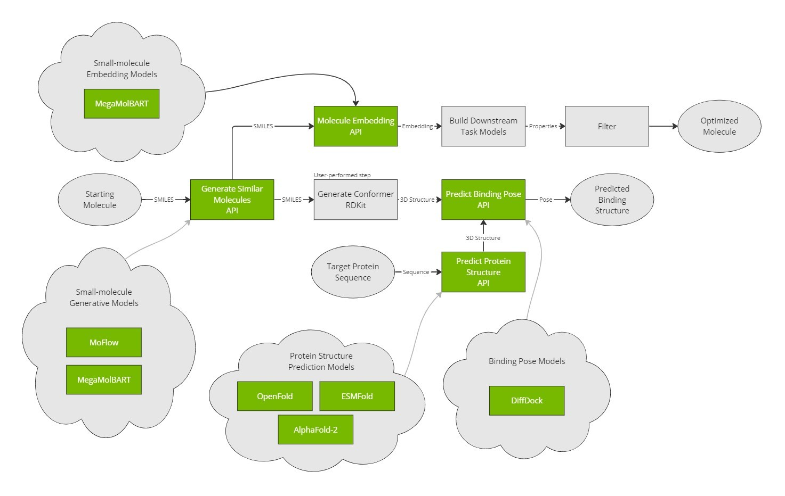
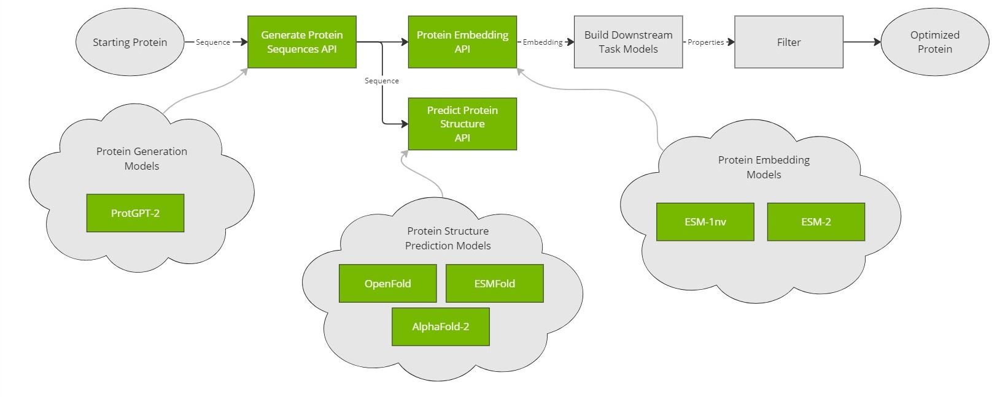

# Use Cases

## BioNeMo Use Cases

### Protein Embeddings

Protein embeddings are a type of machine learning technique used to represent proteins as mathematical vectors that either represent the entire seqeunce as a single vector, or each amino acid in the sequence as a separate vector.
Protein embeddings can be generated using large language models, such as **ESM-1nv**, or **ESM-2**.
These models are trained on large amounts of protein sequence and structure data and learn to generate representations of proteins that capture their functional and structural features.
The embeddings can then be used in downstream tasks, such as predicting protein-ligand interactions.

### Protein Structure Prediction

Protein structure prediction refers to predicting the three-dimensional structure of a protein based on its amino acid sequence.
This is important because a protein's function is often determined by its structure, and accurate structure prediction can aid in drug discovery.
Protein structure prediction models (such as **AlphaFold2**, **ESMFold** and **OpenFold**) are typically trained using deep learning techniques on large datasets of known protein structures.
These models have many uses, including drug discovery, understanding disease mechanisms, and designing new proteins with specific functions.
They can also be used to predict the effects of mutations on protein structure, aiding in the diagnosis and treatment of genetic diseases.

### Protein Sequence Generation

Protein sequence generation models are generative deep learning models that learn to generate new protein sequences that follow the patterns and properties observed in a given training set.
Protein sequence generation models, such as **ProtGPT2** can be applied in a wide range of applications, including drug discovery, by generating novel realistic protein sequences.
They can also be used to explore the space of possible protein sequences.

### Small Molecule Embeddings

Small molecule embeddings are used to represent small molecule features as numerical arrays.
These embeddings are typically created using large language models, like **MegaMolBART**, that learn to encode the structural and chemical properties of molecules into a fixed-length vector.
Small molecule embeddings can be used for a variety of applications, including drug discovery, virtual screening, and chemical similarity searching.
They allow for efficient screening of large libraries of molecules for potential drug candidates, and can also be used to identify novel compounds with similar properties to known drugs.

### Small Molecule Generation

Small molecule generation is the process of using deep learning models to generate novel chemical structures.
These models are typically trained on large databases of existing molecules and learn to generate new molecules that have similar properties to those in the training set.
Small molecule generation models, such as **MegaMolBART** and **MoFlow** can be used for a variety of applications, including drug discovery, that involve *in silico* design of novel molecules.
They allow for the generation of novel compounds and can aid in the discovery of new drug candidates with improved efficacy, safety, and specificity.

### Molecular Docking

Molecular docking is a computational method used to predict the binding affinity and structure of a small molecule ligand binding to a protein target.
This information allows for the identification of potential drug candidates that can selectively bind to a target protein and modulate its function.
Classical molecular docking methods are often based on simulations or heuristics such as complementary shapes. However, these can be either computationally expensive, or rely on approximations and simplifications that can limit their accuracy.
Machine learning models such as **DiffDock** offer new solutions for molecular docking by leveraging existing data to provide more accurate and efficient methods for predicting protein-ligand interactions.
DiffDock learns the complex structural patterns of known ligand-bound proteins (holo structures), uses this learning to predict multiple binding poses for a given ligand-protein pair and ranks the poses in order of prediction confidence.

## Workflows

Taken together, the use cases enabled by BioNeMo also unlock at least two major drug discovery workflows.

### Virtual Screening

Structure-based small molecule drug discovery pipelines are enabled nearly end-to-end using AI models in BioNeMo. Users can generate molecules using MoFlow and MegaMolBART, predict the structure of their target protein with their choice of protein structure prediction models, and dock those molecules to their target protein using DiffDock. Alternatively, molecule embeddings from MegaMolBART can be used to model and/or filter ligands for a variety of downstream uses.

### Protein Design

A structure-based protein design pipeline is enabled through a generative model, ProtGPT-2, and protein structure prediction through both MSA-based and MSA-free protein structure prediction models. As with small molecules, downstream task models can be built on protein embeddings to predict/filter based on desired properties.

