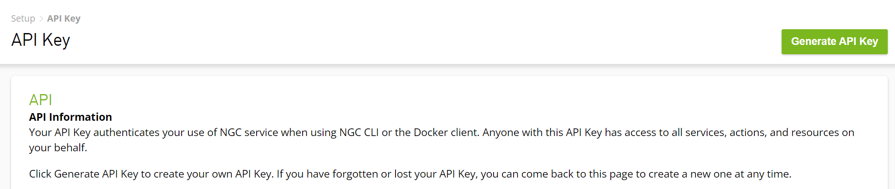

# Working with the API
The BioNeMo Service exposes many functionalities through the API, including:

* List all available models
* Create an inference request
* Query embeddings
* Create an inference request
  * Generate sequences or molecules
  * Predict protein structure
  * Predict ligand pose when bound to protein
* Utilities for querying external resources
* Inference task management

## Getting Started

You can interact with our API gateway using Curl or any programming language like Python/C++ (and others), provided that it supports sending and receiving REST API requests.

In Python, you can use a standard library like [requests](https://requests.readthedocs.io/en/latest/).


## How to Obtain the API Token

Each HTTP request should contain an authorization header field allowing the authentication of the user: "Authorization: Bearer NGC_API_KEY." Herein, NGC_API_KEY is a key that can be obtained from your personal NGC account. Click on your account name on the top right to reveal the drop-down menu, then select **Setup** to reveal the [NGC](https://ngc.nvidia.com/setup/api-key) Setup page where you can generate a new API key.

NOTE: This invalidates any existing key.



Figure 13. Generate the API key

## Important Functions

In this section, we present the details of some most important functionalities.

### List available models

An API function is provided to obtain a list of all models available for inference:

**Curl**

```bash
$ curl -X GET  \
https://api.bionemo.ngc.nvidia.com/v1/models \
 -H "Accept: application/json" \
 -H "Authorization: Bearer ${API_KEY}"
 ```

**Python (via requests library)**

```python
import requests

API_HOST = "https://api.bionemo.ngc.nvidia.com/v1"
API_KEY = "NGC_API_KEY"

response = requests.get(
    f"{API_HOST}/models",
    headers={"Authorization": f"Bearer {API_KEY}"},
)

print(response.content)
```

**Sample response**
```json
{
  "models": [
    {
      "name": "protgpt2",
      "category": "protein-sequence",
      "methods": [
        "generate"
      ]
    },
    {
      "name": "alphafold2",
      "category": "protein-structure",
      "methods": [
        "predict"
      ]
    },
    {
      "name": "esm2-3b",
      "category": "protein-embedding",
      "methods": [
        "embeddings"
      ]
    },
    {
      "name": "esm2-650m",
      "category": "protein-embedding",
      "methods": [
        "embeddings"
      ]
    },
    {
      "name": "esmfold",
      "category": "protein-structure",
      "methods": [
        "predict-no-aln"
      ]
    },
    {
      "name": "megamolbart",
      "category": "molecule",
      "methods": [
        "embeddings",
        "generate"
      ]
    },
    {
      "name": "moflow",
      "category": "molecule",
      "methods": [
        "generate"
      ]
    },
    {
      "name": "openfold",
      "category": "protein-structure",
      "methods": [
        "predict"
      ]
    },
    {
      "name": "diffdock",
      "category": "molecular-docking",
      "methods": [
        "generate"
      ]
    },
    {
      "name": "esm1nv",
      "category": "protein-embedding",
      "methods": [
        "embeddings"
      ]
    },
    {
      "name": "esm2-15b",
      "category": "protein-embedding",
      "methods": [
        "embeddings"
      ]
    }
  ]
}
```

### Query Embedding

These functions can be used to query BioNeMo service for numerical vector representations of biomolecules.

#### ESM-1nv and ESM-2

```
POST https://api.bionemo.ngc.nvidia.com/v1/protein-embedding/{model_name}/embeddings
```
where `{model_name}` is a model name (refer to [List available models](#list-available-models)).

**Curl**
```bash
$ curl -X POST \
https://api.bionemo.ngc.nvidia.com/v1/protein-embedding/{model_name}/embeddings \
-H "Authorization: Bearer ${API_KEY}" \
-d '{"sequence":["MAAHKGAEHHHKAAEHHEQAAKHH"], "format":"h5"}' \
--output "test.h5"
```

**Python (via requests library)**

```python
import requests
import io
import h5py as h5
import numpy as np

API_HOST = "https://api.bionemo.ngc.nvidia.com/v1"
API_KEY = "NGC_API_KEY"

def from_binary(response, format_):
    # alternatively write to file
    data = io.BytesIO(response.content)
    if format_ == 'h5':
        data = h5.File(data)
    elif format_ == 'npz':
        data = np.load(data)
    return data

response = requests.post(
    f"{API_HOST}/protein-embedding/{model_name}/embeddings",
    headers={"Authorization": f"Bearer {API_KEY}"},
    json={
        "sequence": ["MAGVKALVALSFSGAIGLTFLMLGCALEDYGVYWP"],
        "format": "h5"
    }
)

print(from_binary(response, "h5").keys())
```

**Sample response of keys from file object**

```python
<KeysViewHDF5 ['embeddings', 'logits', 'representations', 'tokens']>
```

Parameter description and range:

| Property   | Description                                               | Type            | Range (min-max)                                |
|------------|-----------------------------------------------------------|-----------------|------------------------------------------------|
| `sequence` | List of protein sequences                                 | List of strings | List containing strings of 0 to 511 characters |
| `format`   | Download format type: either HDF5 ("h5") or NumPy ("npz") | String          | "h5" or "npz"                                  |

#### MegaMolBART

```
POST https://api.bionemo.ngc.nvidia.com/v1/molecule/{model_name}/embeddings
```
where `{model_name}` is a model name (refer to [List available models](#list-available-models)).

**Curl**

```bash
$ curl -X POST \
https://api.bionemo.ngc.nvidia.com/v1/molecule/megamolbart/embeddings \
-H "Authorization: Bearer ${API_KEY}" \
-H "Content-Type: application/json" \
-d '{"smis":["O=C(C)Oc1ccccc1C(=O)O"], "format":"h5"}' \
--output "test.h5"
```

**Python (via requests library)**

```python
import requests
import io
import h5py as h5
import numpy as np

API_HOST = "https://api.bionemo.ngc.nvidia.com/v1"
API_KEY = "NGC_API_KEY"

def from_binary(response, format_):
    # alternatively write to file
    data = io.BytesIO(response.content)
    if format_ == 'h5':
        data = h5.File(data)
    elif format_ == 'npz':
        data = np.load(data)
    return data

response = requests.post(
    f"{API_HOST}/molecule/megamolbart/embeddings",
    headers={"Authorization": f"Bearer {API_KEY}"},
    json={
        "smis": ["O=C(C)Oc1ccccc1C(=O)O"],
        "format": "h5"
    }
)

print(from_binary(response, "h5").keys())
```

**Sample response of keys from file object**

```python
<KeysViewHDF5 ['embeddings']>
```

Parameter description and range:

| Property | Description                                               | Type            | Range (min-max)                            |
|----------|-----------------------------------------------------------|-----------------|--------------------------------------------|
| `smis`   | List of SMILES strings                                    | List of strings | List of sequences up to 512 characters each |
| `format` | Download format type: either HDF5 ("h5") or NumPy ("npz") | String          | "h5" or "npz"                              |


### Generate Sequences

Protein sequences and small molecules can be generated with the following API calls.
Protein sequences are generated *de novo*, without any prompt.
Seed molecules can be used for molecule generation to constrain the generation
to molecules that are similar to the seed.

The sequence generation APIs support asynchronous request submission. Therefore, two different processes are required to submit the request and fetch the results. Refer to the [Fetch Results API](#fetch-task) for retrieving the results. The correlation id returned by the API is required for fetching the results.

#### ProtGPT2

```
POST https://api.bionemo.ngc.nvidia.com/v1/protein-sequence/{model_name}/generate
```
where `{model_name}` is a model name (refer to [List available models](#list-available-models)).

**Curl**

```bash
$ curl -X POST \
https://api.bionemo.ngc.nvidia.com/v1/protein-sequence/protgpt2/generate \
 -H "Accept: application/json" \
 -H "Authorization: Bearer $API_KEY" \
 -H "Content-Type: application/json" \
 -d '{"max_length":100, "top_k":950, "repetition_penalty":1.2, "num_return_sequences":10, "percent_to_keep":0.1}'
```

**Python (via requests library)**

```python
import requests

API_HOST = "https://api.bionemo.ngc.nvidia.com/v1"
API_KEY = "NGC_API_KEY"

response = requests.post(
    f"{API_HOST}/protein-sequence/protgpt2/generate",
    headers={"Authorization": f"Bearer {API_KEY}"},
    json={
        "max_length": 100,
        "top_k": 950,
        "repetition_penalty": 1.2,
        "num_return_sequences": 10,
        "percent_to_keep": 0.1,
    }
)

print(response.content)
```

**Sample response after executing Fetch Task with correlation id**

```python
{'generated_sequences': ['MLFQDEYVLTVKQDVANNVKIITGSWFQQEWIPPGGSITFTLNDDFVVVCTSHRWVVDGQENYDYIKIVLNPRKDTPFFLNKNNLVLPCALRFLEYY', 'MCFHSPLPRTILLNRLRYNTPHTLPAPLLTTLLSVLPLLLSYSPLPLLTHHQILHTPRLLQTPVILQHPQLTHPAQLHHMHHLHTRPVLQHTPTHLHPVQLQQTHTTQCQRTLLRQLAQHRSQSLRVPQAPMQLNCVLQPPHTLRLCYCVTVFLSSISLFACFSSAKFICVSIICFVSVLSRSPIISL', 'MYKKIISIFILSVFLLSSCKTFNQVENIQTQMNQLKQMQIDQCQDVLGDLELSELIKDMKDNSNEDIKKSFTEQISVMNNEITKSLKLDVQYKTKVEEGYGFYDVDLTLTTSVGNKKNVKATFSSKGLSLIVGSEQIEQNIAKNMANMKNKVNNVNQKINQSVNQIPDVNKMIDDLNNLLDNINESIQNSNDQIKQSIQKINEDSQKLNQSINDYADQLDIEIPENFDNFINKQ',...],
'perplexities': [2.33, 16.97, 127.09,...]}
```

Parameter description and range:

| Property             | Description                                                                                                                                                                                                                                                                                                                          | Type    | Range (min-max)         |
|----------------------|--------------------------------------------------------------------------------------------------------------------------------------------------------------------------------------------------------------------------------------------------------------------------------------------------------------------------------------|---------|-------------------------|
| `max_length`          | Maximum number  of tokens to generate. As tokens comprise an average of three to four amino acids, the resulting protein sequences will be longer than max_length in terms of number of amino acids.                                                                                                                                        | integer | 100 - 500, default: 150 |
| `top_k`                | Sampling of the k most probable tokens from the vocabulary as a decoding mechanism.                                                                                                                                                                                                                                                  | integer | 250 -1000, default: 950 |
| `repetition_penalty`   | Penalty to avoid repeats when random sampling at decoding. Recommended range is 1.1 to 1.3.                                                                                                                                                                                                                                          | float   | 1.0 - 3.0, default: 1.2 |
| `num_return_sequences` | Number of protein sequences to be returned in the API’s response.                                                                                                                                                                                                                                                                    | integer | 1 - 10000, default: 10  |
| `percent_to_keep`      | The API’s response contains only the sequences with the top `percent_to_keep` perplexities. If value < 1.0, sequences will be generated iteratively until `num_return_sequences` and `percent_to_keep` are satisfied. This can result in longer runtimes. A value of 1.0 means bypassing this perplexity filter and hence faster response. | float   | 0.1 - 1.0, default: 0.1   |


NOTE: Depending on the choices for generation parameters, in some cases with too restrictive values, the API may return a timeout error message for not being able to timely generate “valid” sequences. In these situations, changing the generation parameters is recommended.

#### MegaMolBART and MoFlow

```
POST https://api.bionemo.ngc.nvidia.com/v1/molecule/{model_name}/generate
```
where `{model_name}` is a model name (refer to [List available models](#list-available-models)).

**Curl**

```bash
$ curl -X POST  \
https://api.bionemo.ngc.nvidia.com/v1/molecule/{model_name}/generate \
-H "Accept: application/json" \
-H "Authorization: Bearer $API_KEY" \
-H "Content-Type: application/json" \
-d '{"smis":["O=C(C)Oc1ccccc1C(=O)O"], "num_samples":10, "scaled_radius":0.1}'
```

**Python (via requests library)**

```python
import requests

API_HOST = "https://api.bionemo.ngc.nvidia.com/v1"
API_KEY = "NGC_API_KEY"

response = requests.post(
    f"{API_HOST}/molecule/megamolbart/generate",
    headers={"Authorization": f"Bearer {API_KEY}"},
    json={
        "smis": ["O=C(C)Oc1ccccc1C(=O)O"],
        "num_samples": 10,
        "scaled_radius": 0.1
    }
)

print(response.content)
```

**Sample response after executing Fetch Task with correlation id**

```json
[[{"sample": "CC(=O)Oc1ccccc1C(=O)O", "similarity_scores": 1.0}, {"sample": "O=C(O)c1ccccc1O[SH](=O)=O", "similarity_scores": 0.4381551444530487}, {"sample": "CC(=O)Oc1ccccc1C(O)O", "similarity_scores": 0.6675127148628235}, {"sample": "CC(=O)Cc1ccccc1C(C)=O", "similarity_scores": 0.17222222685813904}, {"sample": "CC(Cl)Oc1ccccc1C(=O)O", "similarity_scores": 0.7349397540092468}, {"sample": "CC(=O)Oc1ccccc1C(=O)O", "similarity_scores": 1.0}, {"sample": "C=[SH](=O)Oc1ccccc1C(O)O", "similarity_scores": 0.2947976887226105}, {"sample": "CC(=O)Cc1ccccc1C(=O)O", "similarity_scores": 0.24581006169319153}, {"sample": "C=[SH](=O)Cc1ccccc1P(=O)(O)O", "similarity_scores": 0.17496229708194733}, {"sample": "NC(=O)Cc1ccccc1C(=O)O", "similarity_scores": 0.2504638135433197}]]
```

The returned value for "similarity_scores" is the Tanimoto similarity to the seed molecule, as implemented by [RDKit](https://www.rdkit.org/).

Parameter description and range:

| Property        | Description                                                            | Type            | Range (min-max)                           |
|-----------------|------------------------------------------------------------------------|-----------------|-------------------------------------------|
| `smis`          | SMILES molecule sequence. Only used by MegaMolBART. | List of strings | List containing one or more sequences     |
| `smi`           | SMILES molecule sequence. Only used by MoFlow.                        | string          | Sequence ranging from 0 to 511 characters |
| `num_samples`   | Number of sampled molecules to be returned as SMILES.                  | int             | Minimum 1                                |
| `scaled_radius` | Normalized scale of the Gaussian noise to use for sampling. Scaled radius of 1 corresponds to the noise scale producing optimal effective novelty. Only used by MegaMolBART.                         | float           | Minimum 1.0,  Default: 1.0                |
| `temperature` | Adjust temperature to control the structural output of MoFlow generated molecules. Higher temperature settings generate more complex and diverse molecules, while lower values generate more chemical valid compounds. Only used by MoFlow.                         | float           | Minimum: 0.2,  Default: 0.25                |


NOTE: The molecules generated by MegaMolBART do not always match the choice in `num_samples` parameter.

For example:

```bash
curl -X POST https://api.stg.bionemo.ngc.nvidia.com/v1/molecule/megamolbart/generate -H 'Content-Type: application/json' -H "Authorization: Bearer $API_KEY_STAGING" -d '{"smis": ["O=C(C)Oc1ccccc1C(=O)O"], "num_samples": 10}'
```
Produces a response with anywhere from 8-12 molecules when I execute the command multiple times.

`num_samples` is also listed as a parameter with a default value in the API spec; however, on staging, it's required to explicitly pass `num_samples`.


### Predict Structure

The BioNeMo Service API can be used to predict the 3-dimensional conformation of a protein based on its amino acid sequence.

The structure prediction APIs support asynchronous request submission. Therefore, supporting the request and fetching the results are two different processes. Refer to the [Fetch Results API](#fetch-task) for retrieving the results. The correlation id returned by the API is required for fetching the results. Through the API, the user can only submit up to eight concurrent OpenFold or AlphaFold-2 requests at a time.

#### AlphaFold-2 and OpenFold

```
POST https://api.bionemo.ngc.nvidia.com/v1/protein-structure/{model_name}/predict
```
where `{model_name}` is a model name (refer to [List available models](#list-available-models)).

**Curl**

```bash
$ curl -X POST \
https://api.bionemo.ngc.nvidia.com/v1/protein-structure/{model_name}/predict \
 -H "Authorization: Bearer $API_KEY" \
 -F sequence="MAAHKGAEHHHKAAEHHEQAAKHHHAAAEHHE" \
 -F relax_prediction="true" \
 -F use_msa="true" \
 -F msas="@path/to/mgnify_hits.a3m" # Specify the file here to use custom MSA. MSA will be computed if no file is uploaded.
```

**Python (via requests library)**

```python
import requests

API_HOST = "https://api.bionemo.ngc.nvidia.com/v1"
API_KEY = "NGC_API_KEY"

response = requests.post(
    f"{API_HOST}/protein-structure/{model_name}/predict",
    headers={"Authorization": f"Bearer {API_KEY}"},
    files={
        "sequence": (None, "MAGVKALVALSFSGAIGLTFLMLGCALEDYGVYWP"),
        "relax_prediction": (None, "true"),
        "use_msa": (None, "true"),
        "msas": "@path/to/mgnify_hits.a3m", # Specify the file here to upload an MSA. MSA will be computed if this argument is not used.
    }
)

print(response.content)
```

**Sample response after executing Fetch Task with correlation id**
```python
{"pdbs": [\"PARENT N/A\\nATOM      1  N   MET A   1     -25.361  -7.932  15.178  1.00 48.48           N  \\nATOM      2  H   MET A   1     -25.582  -8.530  14.394  1.00 48.48           H  \\nATOM      3  H2  MET A   1     -26.024  -8.115  15.917  1.00 48.48           H  \\nATOM      4  H3  MET A   1     -25.444  -6.968  14.888  1.00 48.48           H  \\nATOM      5  CA  MET A   1     -23.984  -8.226  15.641  1.00 48.48           C  \\nATOM      6  HA  MET A   1     -23.712  -7.569  16.468  1.00 48.48           H  \\nATOM      7  C   MET A   1     -23.017  -7.971  14.488  1.00 48.48           C  \\nATOM      8  CB  MET A   1     -23.884  -9.685  16.120  1.00 48.48           C  \\nATOM      9  HB2 MET A   1     -24.375 -10.340  15.400  1.00 48.48           H  \\nATOM     10  HB3 MET A   1     -22.834  -9.971  16.179  1.00 48.48           H  \\n…TER     501      PRO A  34                                                       \\nEND   \\n\"]}"}
```

Parameter description and range:

| Property          | Description                    | Type    | Range (min-max)       |
|-------------------|--------------------------------|---------|-----------------------|
| `sequence`        | Protein sequence               | string  | 0 to 5000 characters  |
| `relaxPrediction` | Perform relaxation step        | boolean | true (default), false |
| `useMsa`          | Compute MSA                    | boolean | true (default), false |
| `msas`            | Path to user computed MSA file | string  | NA                    |


#### ESMFold

```
POST https://api.bionemo.ngc.nvidia.com/v1/protein-structure/{model_name}/predict-no-aln
```
where `{model_name}` is a model name (refer to [List available models](#list-available-models)).

**Curl**

```bash
$ curl -X POST \
https://api.bionemo.ngc.nvidia.com/v1/protein-structure/{model_name}/predict-no-aln \
 -H "Accept: application/json" \
 -H "Authorization: Bearer $NGC_API_KEY" \
 -H "Content-Type: application/json" \
 -d '{"sequence":"MAAHKGAEHHHKAAEHHEQAAKHHHAAAEHHE"}'
```

**Python (via requests library)**

```python
import requests

API_HOST = "https://api.bionemo.ngc.nvidia.com/v1"
API_KEY = "NGC_API_KEY"

response = requests.post(
    f"{API_HOST}/protein-structure/{model_name}/predict-no-aln",
    headers={"Authorization": f"Bearer {API_KEY}"},
    json={
        "sequence": "MAGVKALVALSFSGAIGLTFLMLGCALEDYGVYWP",
    }
)

print(response.content)
```

**Sample response after executing Fetch Task with correlation id**

```
PARENT N/A
ATOM      1  N   MET A   1      -9.322 -12.897 -19.716  1.00 74.99           N
ATOM      2  CA  MET A   1      -8.041 -12.240 -19.472  1.00 79.13           C
ATOM      3  C   MET A   1      -8.222 -11.003 -18.599  1.00 79.07           C
ATOM      4  CB  MET A   1      -7.372 -11.855 -20.792  1.00 67.13           C
…
ATOM    250  N   PRO A  35       0.794  17.268  11.533  1.00 57.83           N
ATOM    251  CA  PRO A  35      -0.105  18.265  12.120  1.00 59.25           C
ATOM    252  C   PRO A  35      -1.525  18.178  11.565  1.00 57.85           C
ATOM    253  CB  PRO A  35       0.549  19.596  11.742  1.00 52.39           C
ATOM    254  O   PRO A  35      -1.720  17.757  10.422  1.00 55.81           O
ATOM    255  CG  PRO A  35       1.818  19.215  11.051  1.00 49.69           C
ATOM    256  CD  PRO A  35       1.789  17.739  10.779  1.00 52.83           C
TER     257      PRO A  35
END
```

Parameter description and range:

| Property   | Description      | Type   | Range (min-max)      |
|------------|------------------|--------|----------------------|
| `sequence` | Protein sequence | string | 0 to 5000 characters |


### Predict Ligand Pose in Protein

The API can be used to predict the binding affinity and orientation of a small molecule ligand to a protein target with **DiffDock**.

The molecular docking API supports asynchronous request submission. Therefore, supporting the request and fetching the results are two different processes. Refer to the [Fetch Results API](#fetch-task) for retrieving the results. The correlation id returned by the API is required for fetching the results.

#### DiffDock

```
POST https://api.bionemo.ngc.nvidia.com/v1/molecular-docking/{model_name}/generate
```

where `{model_name}` is a model name (refer to [List available models](#list-available-models)).

**Curl**

```bash
$ curl -X POST \
https://api.bionemo.ngc.nvidia.com/v1/molecular-docking/diffdock/generate \
-H "Accept: application/json" \
-H "Authorization: Bearer $API_KEY" \
-F ligand_file_bytes="@path/to/6uii_ligand.mol2" \ # Update file path here to customize ligand
-F protein_file_bytes="@path/to/6uii_protein_processed.pdb" \  # Update file path here to customize protein
-F poses_to_generate=1 \
-F diffusion_time_divisions=20 \
-F diffusion_steps=18 \
-F save_diffusion_trajectory="true"
```

**Python (via requests library)**

```python
import requests

API_HOST = "https://api.bionemo.ngc.nvidia.com/v1"
API_KEY = "NGC_API_KEY"

with open("path/to/6uii_ligand.mol2", "rb") as lf, \
  open("path/to/6uii_protein_processed.pdb", "rb") as pf: # update file path(s) here to customize ligand/protein
    files = {"ligand_file_bytes": lf, "protein_file_bytes": pf}

    response = requests.post(
        f"{API_HOST}/molecular-docking/diffdock/generate",
        headers={"Authorization": f"Bearer {API_KEY}"},
        data={
            "poses_to_generate": 1,
            "diffusion_time_divisions": 20,
            "diffusion_steps": 18,
            "save_diffusion_trajectory": "true"
        },
        files=files
    )

print(response.content)
```

**Sample response after executing Fetch Task with correlation id**

```json
{"docked_ligand_position_files": ["6uii_ligand\n     RDKit          3D\n\n 11 10  0  0  0  0  0  0  0  0999 V2000\n  -30.1300  -38.9563   34.9841 C   0  0  0  0  0  0  0  0  0  0  0  0\n  -28.7977  -38.2864   35.2655 C   0  0  0  0  0  0  0  0  0  0  0  0\n  -27.7166  -38.8233   34.3565 C   0  0  0  0  0  0  0  0  0  0  0  0\n  -25.6090  -39.0121   35.3816 C   0  0  0  0  0  0  0  0  0  0  0  0\n  -24.5454  -39.0835   34.3514 C   0  0  0  0  0  0  0  0  0  0  0  0\n  -23.7114  -40.2869   34.2525 C   0  0  0  0  0  0  0  0  0  0  0  0\n  -22.4079  -40.2770   33.5953 C   0  0  0  0  0  0  0  0  0  0  0  0\n  -21.1605  -40.3100   34.3772 C   0  0  0  0  0  0  0  0  0  0  0  0\n  -31.2020  -38.0215   35.3481 N   0  0  0  0  0  4  0  0  0  0  0  0\n  -26.8193  -39.7362   35.0306 N   0  0  0  0  0  4  0  0  0  0  0  0\n  -19.7659  -40.2991   33.1588 S   0  0  0  0  0  0  0  0  0  0  0  0\n  2  1  1  0\n  1  9  1  0\n  3  2  1  0\n 10  3  1  0\n  4  5  1  0\n  4 10  1  0\n  5  6  1  0\n  6  7  1  0\n  7  8  1  0\n  8 11  1  0\nM  CHG  2   9   1  10   1\nM  END\n>  <_TriposChargeType>  (1) \nGAST_HUCK\n\n$$$$\n"], "visualization_files": ["MODEL\nCOMPND    6uii_ligand\nHETATM    1  C1  UNL     1       3.035  -0.382   0.542  1.00  0.00           C  \nHETATM    2  C2  UNL     1       2.664   1.089   0.571  1.00  0.00           C  \nHETATM    3  C3  UNL     1       1.208   1.276   0.930  1.00  0.00           C  \nHETATM    4  C4  UNL     1      -0.396  -0.426   0.686  1.00  0.00           C  \nHETATM    5  C5  UNL     1      -1.006  -1.432  -0.216  1.00  0.00           C  \nHETATM    6  C6  UNL     1      -1.981  -1.003  -1.226  1.00  0.00           C  …\nHETATM   32  H21 UNL     1      -0.315   1.331  -0.425  1.00  0.00           H  \nHETATM   33  H22 UNL     1      -5.780   0.218   0.308  1.00  0.00           H  \nENDMDL\n"], "pose_confidence": [-0.178630530834198]}
```

Parameter description and range:

| Property                    | Description                                                                                                                                                        | Type        | Range (min-max)                    |
|-----------------------------|--------------------------------------------------------------------------------------------------------------------------------------------------------------------|-------------|------------------------------------|
| `ligand_file_bytes`         | Ligand file. For curl, this is the relative path with a "@" prepended. For python, this is the file read in binary format.                                         | string/file | Maximum file size allowed is 5MB   |
| `protein_file_bytes`        | Protein file. For curl, this is the relative path with a "@" prepended. For python, this is the file read in binary format.                                        | string/file | Maximum file size allowed is 10MB  |
| `poses_to_generate`         | Number of poses to compute.                                                                                                                                        | int         | 1-100, Default: 20                 |
| `diffusion_time_divisions`  | Number of steps the diffusion time is divided into. This quantity is used for scheduling the appropriate noise for each step.                                      | int         | 1-100, Default: 20                 |
| `diffusion_steps`           | Number of steps the (reverse) diffusion takes place. This quantity determines the actual amount of inference steps performed.                                      | int         | 1-100, Default: 18                 |
| `save_diffusion_trajectory` | Boolean that determines whether to output ligand atomic positions during the (reverse) diffusion for each pose. Available via the API only, not in the Playground. | boolean     | “true”/”false” Default: “false”    |


### Utilities

#### Get protein sequence from UniProt ID

Use the UniProt Lookup API for retrieving the protein sequence corresponding to a given UniProt ID.

```
GET https://api.bionemo.ngc.nvidia.com/v1/uniprot/{uniprotId}
```

**Curl**

```bash
$ curl -X GET \
https://api.bionemo.ngc.nvidia.com/v1/uniprot/P62068 \
-H "Authorization: Bearer $API_KEY"
```

**Python (via requests library)**

```python
import requests

API_HOST = "https://api.bionemo.ngc.nvidia.com/v1"
API_KEY = "NGC_API_KEY"

response = requests.get(
    f"{API_HOST}/uniprot/P62068",
    headers={"Authorization": f"Bearer {API_KEY}"}
)

print(response.content)
```

**Sample response example**

```python
"MTVRNIASICNMGTNASALEKDIGPEQFPINEHYFGLVNFGNTCYCNSVLQALYFCRPFRENVLAYKAQQKKKENLLTCLADLFHSIATQKKKVGVIPPKKFISRLRKENDLFDNYMQQDAHEFLNYLLNTIADILQEEKKQEKQNGKLKNGNMNEPAENNKPELTWVHEIFQGTLTNETRCLNCETVSSKDEDFLDLSVDVEQNTSITHCLRDFSNTETLCSEQKYYCETCCSKQEAQKRMRVKKLPMILALHLKRFKYMEQLHRYTKLSYRVVFPLELRLFNTSSDAVNLDRMYDLVAVVVHCGSGPNRGHYITIVKSHGFWLLFDDDIVEKIDAQAIEEFYGLTSDISKNSESGYILFYQSRE"
```

Parameter description and range:

|Property    | Description                                | Type   | Range (min-max) |
|------------|--------------------------------------------|--------|-----------------|
| `unprotId` | A UniProtID to use for sequence retrieval. | string | NA              |


#### Get SMILES from PubChem CID

Use the PubChem Lookup API for retrieving the SMILES corresponding to a given PubChem CID.

```
GET https://api.bionemo.ngc.nvidia.com/v1/pubchem/{cid}
```

**Curl**

```bash
$ curl -X GET \
https://api.bionemo.ngc.nvidia.com/v1/pubchem/2224 \
-H "Authorization: Bearer $API_KEY"
```

**Python (via requests library)**

```python
import requests

API_HOST = "https://api.bionemo.ngc.nvidia.com/v1"
API_KEY = "NGC_API_KEY"

response = requests.get(
    f"{API_HOST}/pubchem/2244",
    headers={"Authorization": f"Bearer {API_KEY}"}
)

print(response.content)
```

**Sample response example**

```python
"CC(=O)OC1=CC=CC=C1C(=O)O"
```

Parameter description and range:

|Property    | Description         | Type   | Range (min-max) |
|------------|---------------------|--------|-----------------|
| `cid`      | A valid PubChem CID | string | NA              |

### Task Management

#### Fetch Task

Use the Fetch Task API for retrieving results and status from a previously submitted asynchronous API request.

```
GET https://api.bionemo.ngc.nvidia.com/v1/task/{CORRELATION_ID}
```

**Curl**

```bash
$ curl -X GET \
https://api.bionemo.ngc.nvidia.com/v1/task/eecb32b5-0baa-4faf-91ca-8dca1fa2d93b \
-H "Authorization: Bearer $API_KEY"
```

**Python (via requests library)**

```python
import requests

API_HOST = "https://api.bionemo.ngc.nvidia.com/v1"
API_KEY = "NGC_API_KEY"

response = requests.get(
    f"{API_HOST}/task/{correlationId}",
    headers={"Authorization": f"Bearer {API_KEY}"}
)

print(response.content)
```


**Sample response examples**

```python
{"correlationId":"f6e3248e-6a93-4d50-89ba-dcffbad5170e","request":"","response":""}
```
Or

```python
{
  "response": "{\"pdbs\": [\"PARENT N/A\\nATOM      1  N  ...  HIS A  47\\nEND\\n\"]}",
  "request": "{\"sequence\":\"MSLKRKNIALIPAAGIGVRFGADKPKQYVEIGSKTVLEHVLGIFERH\",\"source\":\"api\"}",
  "control_info": {
    "status": "DONE",
    "percent_completed": 100,
    "source": "web",
    "correlation_id": "f6e3248e-6a93-4d50-89ba-dcffbad5170e"
  }
}
```

Parameter description and range:

| Property        | Description                             | Type   | Range (min-max)                |
|-----------------|-----------------------------------------|--------|--------------------------------|
| `correlationId` | A token to relate request and response. | string | As received during submission. |


#### Cancel Task

Use the Cancel Task API to cancel a previously submitted asynchronous API request.

```
PUT https://api.bionemo.ngc.nvidia.com/v1/cancel/{CORRELATION_ID}
```

**Curl**

```bash
$ curl -X PUT \ https://api.bionemo.ngc.nvidia.com/v1/cancel/f535f70b-ecd5-4adc-9b49-a4f50873823b \
 -H "Authorization: Bearer $NGC_API_KEY"
```

**Python (via requests library)**

```python
import requests

API_HOST = "https://api.bionemo.ngc.nvidia.com/v1"
API_KEY = "NGC_API_KEY"

response = requests.put(
    f"{API_HOST}/cancel/{correlationId}",
    headers={"Authorization": f"Bearer {API_KEY}"}
)

print(response.content)
```


**Sample response**

```python
"cancelled"
```

| Property        | Description                             | Type   | Range (min-max)                |
|-----------------|-----------------------------------------|--------|--------------------------------|
| `correlationId` | A token to relate request and response. | string | As received during submission. |


#### Delete Task

Use the Delete Task API to delete the results from a previously submitted asynchronous API call.

```
DELETE https://api.bionemo.ngc.nvidia.com/v1/task/{CORRELATION_ID}
```

**Curl**

```bash
$ curl -X DELETE \ https://api.bionemo.ngc.nvidia.com/v1/task/f535f70b-ecd5-4adc-9b49-a4f50873823b \
 -H "Authorization: Bearer $NGC_API_KEY"
```

**Python (via requests library)**

```python
import requests

API_HOST = "https://api.bionemo.ngc.nvidia.com/v1"
API_KEY = "NGC_API_KEY"

response = requests.delete(
    f"{API_HOST}/task/{correlationId}",
    headers={"Authorization": f"Bearer {API_KEY}"}
)

print(response.content)
```

**Sample response**

```python
"deleted"
```

Parameter description and range:
| Property        | Description                             | Type   | Range (min-max)                |
|-----------------|-----------------------------------------|--------|--------------------------------|
| `correlationId` | A token to relate request and response. | string | As received during submission. |


#### Fetch All Tasks
Use the Fetch Tasks API to fetch a list of recently executed tasks.

```
GET https://api.bionemo.ngc.nvidia.com/v1/tasks
```

**Curl**

```bash
$ curl -X GET \ https://api.bionemo.ngc.nvidia.com/v1/tasks \
 -H "Authorization: Bearer $NGC_API_KEY"
```

**Python (via requests library)**

```python
import requests

API_HOST = "https://api.bionemo.ngc.nvidia.com/v1"
API_KEY = "NGC_API_KEY"

response = requests.get(
    f"{API_HOST}/tasks",
    headers={"Authorization": f"Bearer {API_KEY}"}
)

print(response.content)
```

**Sample response**

```json
{"tasks":[{"source":"api","category":"protein-structure","model":"openfold","method":"predict","correlation_id":"0f09799a-b579-4a11-890f-ae39a34ae204","status":"DONE","request":"{\"sequence\":\"MAAHKGAEHHHKAAEHHEQAAKHHHAAAEHHEPPYYYPPP\",\"use_msa\":true,\"relax_prediction\":true}"},{"source":"web","category":"protein-structure","model":"alphafold2","method":"predict","correlation_id":"9e43b0c4-68e8-4c7e-8ce6-07ffff1dfa5c","status":"ERROR","request":"{\"sequence\":\"ALTQPSSVSANPGGTVKITCSGSSSAYGYGWYQQKSPGSAPVTVIYNNNKRPSNIPSRFSGSKSGSTGTLTITGVQAEDEAVYFCGSEDSSTDAIFGAGTTLTVLGQSSRSSSGGGSSGGGGSTVTLDESGGGLQAPGGALSLVCKASGFTFSSYDMGWIRQAPGKGLEYVAGITDNGRYASYGSAVDGRATISRDNGQSSVRLQLNNLRAEDTGTYYCARDDGSGWTGNSIDAWGHGTEVIVSENLYFQ\",\"source\":\"web\",\"use_msa\":true,\"relax_prediction\":true}"}]}
```
